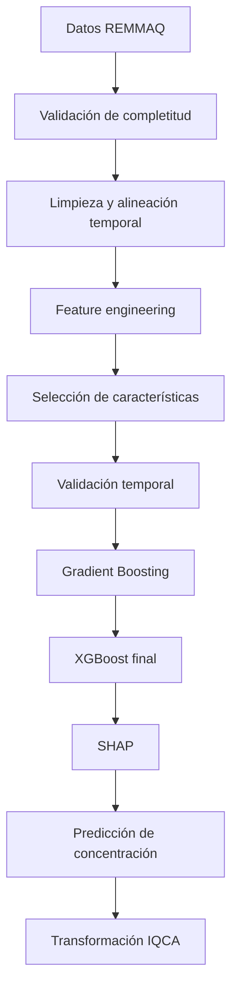

# Quito Air ML

## Modelo sustituto para pronóstico de calidad del aire en Quito

Academic machine learning pipeline for air quality forecasting in Quito using REMMAQ data, temporal feature engineering, XGBoost, SHAP and NiceGUI.

[](https://www.python.org/)
[](https://nicegui.io/)
[](https://xgboost.ai/)
[](https://scikit-learn.org/)
[](https://shap.readthedocs.io/)


## Sobre el proyecto

Quito Air ML corresponde a un Trabajo de Titulación orientado al pronóstico académico de calidad del aire mediante datos históricos de la Red Metropolitana de Monitoreo Atmosférico de Quito (REMMAQ). El dataset integra PM2.5, PM10, O3, CO, NO2 y SO2, además de variables meteorológicas cuando están disponibles.

El trabajo incorpora limpieza y alineación temporal, ingeniería de características, selección de variables y validación temporal. Durante la evolución experimental se compararon HistGradientBoosting, XGBoost y LightGBM; XGBoost fue la configuración seleccionada bajo el protocolo evaluado. La implementación actual integra interpretabilidad con SHAP, una interfaz NiceGUI y una transformación posterior de la concentración estimada a IQCA.

Aunque el dataset puede contener los seis contaminantes, cada ejecución de la aplicación final utiliza un contaminante seleccionado como variable objetivo. No se trata de una única regresión multisalida simultánea.

## Alcance y advertencia

Este software constituye un prototipo académico desarrollado como parte de un Trabajo de Titulación. No sustituye las mediciones instrumentales de la REMMAQ, los boletines oficiales de calidad del aire ni un sistema institucional de alerta temprana. Las categorías IQCA mostradas por la aplicación corresponden a una transformación posterior de la concentración estimada.

## Implementaciones finales

Los dos archivos marcados como **FINAL / CURRENT IMPLEMENTATION** son:

- [`src/script_limpieza_niceGUI.py`](src/script_limpieza_niceGUI.py): carga, diagnóstico, validación de completitud, limpieza y consolidación de archivos REMMAQ.
- [`src/modelo_ia_niceGUI_SHAP.py`](src/modelo_ia_niceGUI_SHAP.py): selección del objetivo, entrenamiento, validación temporal, resultados, SHAP, predicción e IQCA.

Los notebooks de `notebooks/` se conservan únicamente para trazabilidad experimental y no son requisitos para ejecutar estas aplicaciones.

## Flujo metodológico



La evaluación usa divisiones cronológicas y `TimeSeriesSplit`. Cuando se informa el desempeño final, se denomina **conjunto de prueba temporal final**.

## Criterio de completitud

El pipeline considera elegible una parroquia cuando dispone de al menos 10 de los 11 grupos requeridos: seis contaminantes y cinco variables meteorológicas. Esto permite como máximo una variable estructuralmente ausente. Es un criterio operativo del proyecto, no una norma universal.

Se verificó funcionalmente el procesamiento para Belisario, Carapungo, Centro, Cotocollao y Tumbaco. Cada parroquia requiere su propio procesamiento, reentrenamiento y validación; las métricas del caso piloto de Carapungo no son atribuibles a las demás.

## Preparación y limpieza de datos

`script_limpieza_niceGUI.py` proporciona una interfaz independiente para cargar archivos REMMAQ, reconocer variables, evaluar la completitud por parroquia, aplicar reglas de limpieza y generar un dataset CSV consolidado.


La interfaz acepta una carpeta local o cargas de archivos CSV/XLSX/XLS. Los nombres y la estructura esperados están documentados en [`data/README.md`](data/README.md).


## Entrenamiento del modelo

La aplicación predictiva permite cargar el CSV preparado, elegir un contaminante objetivo y entrenar XGBoost con ingeniería de características, selección de variables y validación temporal. El 80 % inicial de los datos se reserva cronológicamente para entrenamiento y el 20 % final para prueba; dentro del entrenamiento se utiliza además un tramo de validación para *early stopping*.


## Interpretabilidad con SHAP

La opción SHAP genera un Summary Plot global, un Beeswarm Plot y un Waterfall Plot para una predicción individual.


SHAP describe las contribuciones aprendidas por el modelo; no demuestra causalidad ambiental.

## Predicción e IQCA

La aplicación sigue este flujo:

`concentración estimada` → `transformación determinística` → `valor y categoría IQCA`

El modelo predice concentración, no IQCA directamente.

## Resultados del caso piloto

Los resultados formalmente documentados para Carapungo con PM2.5 son:

| Métrica | Resultado |
|---|---:|
| R² | 0.9866 |
| MAE | ≈ 0.49 µg/m³ |

Los resultados corresponden al caso piloto de Carapungo y no deben transferirse directamente a otras parroquias. R² es un coeficiente de determinación, no un porcentaje de precisión.

## Evolución experimental

| Etapa | Archivo | Propósito |
|---|---|---|
| Preparación inicial | [`notebooks/data_preparation/creacion_dataset_V2.ipynb`](notebooks/data_preparation/creacion_dataset_V2.ipynb) | Primeras rutinas de construcción del dataset |
| Dataset consolidado | [`notebooks/data_preparation/Scrip_Dataset_IA_VF.ipynb`](notebooks/data_preparation/Scrip_Dataset_IA_VF.ipynb) | Evolución del pipeline de preparación |
| ML inicial | [`notebooks/model_evolution/modelo_ia_sikilearn.ipynb`](notebooks/model_evolution/modelo_ia_sikilearn.ipynb) | Primeras evaluaciones con modelos tabulares |
| Evolución | [`notebooks/model_evolution/modelo_V3_IA.ipynb`](notebooks/model_evolution/modelo_V3_IA.ipynb) | Iteración posterior del pipeline |
| Validación temporal | [`notebooks/model_evolution/version_IA_K-fold.ipynb`](notebooks/model_evolution/version_IA_K-fold.ipynb) | Desarrollo de estrategias de validación |
| Modelo consolidado | [`notebooks/model_evolution/Modelo_surrogante_final.ipynb`](notebooks/model_evolution/Modelo_surrogante_final.ipynb) | Consolidación experimental |
| Deep Learning | [`notebooks/experiments/IA_deeplearning_V1.ipynb`](notebooks/experiments/IA_deeplearning_V1.ipynb) | Exploración de alternativas |
| Aplicación final | [`src/modelo_ia_niceGUI_SHAP.py`](src/modelo_ia_niceGUI_SHAP.py) | Sistema predictivo final |
| Limpieza final | [`src/script_limpieza_niceGUI.py`](src/script_limpieza_niceGUI.py) | Aplicación final de preparación REMMAQ |

Estos archivos documentan etapas de trabajo; no constituyen *releases* oficiales independientes.

## Estructura del repositorio

```text
.
├── CITATION.cff
├── README.md
├── requirements.txt
├── data/
│   └── README.md

├── notebooks/
│   ├── data_preparation/
│   ├── experiments/
│   └── model_evolution/
└── src/
    ├── modelo_ia_niceGUI_SHAP.py
    └── script_limpieza_niceGUI.py
```

Los datos originales, modelos entrenados, cargas temporales y resultados generados están excluidos mediante `.gitignore`.

## Instalación

Se recomienda Python 3.11. Desde una terminal:

```bash
git clone https://github.com/sJonathan15/quito-air-quality-surrogate-model.git
cd quito-air-quality-surrogate-model
python3 -m venv .venv
source .venv/bin/activate
python -m pip install --upgrade pip
python -m pip install -r requirements.txt
```

En Windows PowerShell, la creación y activación del entorno cambia a:

```powershell
py -3.11 -m venv .venv
.venv\Scripts\Activate.ps1
python -m pip install --upgrade pip
python -m pip install -r requirements.txt
```

### Ejecutar la aplicación de limpieza

Desde la raíz del repositorio:

```bash
python src/script_limpieza_niceGUI.py
```

La aplicación escucha en `http://localhost:3002`. La variable de entorno `PORT` puede sustituir ese puerto. Prepare los archivos según [`data/README.md`](data/README.md); los datos REMMAQ no se descargan automáticamente.

### Ejecutar la aplicación predictiva

En otra terminal con el entorno activado:

```bash
python src/modelo_ia_niceGUI_SHAP.py
```

La aplicación escucha en `http://localhost:3000`, o en el puerto indicado por `PORT`. Primero debe cargarse el CSV generado por la aplicación de limpieza; sin ese archivo puede abrirse la interfaz, pero no entrenar ni predecir.

Ambas aplicaciones enlazan el servidor a `0.0.0.0`. En equipos compartidos o expuestos a una red, aplique controles de acceso y firewall apropiados.

## Dependencias y hardware

`requirements.txt` contiene las dependencias comprobadas para las aplicaciones actuales. `openpyxl` y `xlrd` permiten leer Excel; `pyarrow` habilita la exportación opcional de valores SHAP a Parquet. LightGBM y Gradio aparecen únicamente en etapas históricas y no son requisitos de la implementación final.

El proyecto fue desarrollado y evaluado en un entorno que incluyó una NVIDIA Tesla V100 de 16 GB. La aplicación detecta automáticamente CUDA para XGBoost y utiliza CPU cuando no encuentra una GPU compatible; la GPU acelera determinadas tareas, pero no es obligatoria para iniciar la interfaz ni para todo el flujo.

## Limitaciones

- La calidad del resultado depende de la cobertura, consistencia y representatividad temporal de los datos de entrada.
- La transformación IQCA debe interpretarse dentro del alcance académico del proyecto.
- Una configuración validada para una parroquia no queda validada automáticamente para otra.
- Los artefactos `.pkl` son generados localmente y no se publican en el repositorio.
- El repositorio no incluye una licencia de reutilización; el autor debe confirmar las condiciones de propiedad intelectual antes de incorporar una.

## Citación

La información de citación está disponible en [`CITATION.cff`](CITATION.cff). No se ha asignado un DOI a esta versión.

## Autor

**Jonathan Alexander Cañar Quishpe**  
Trabajo de Titulación  
Universidad Tecnológica Indoamérica

**Tutor:** Andrés Xavier Rubio Proaño
